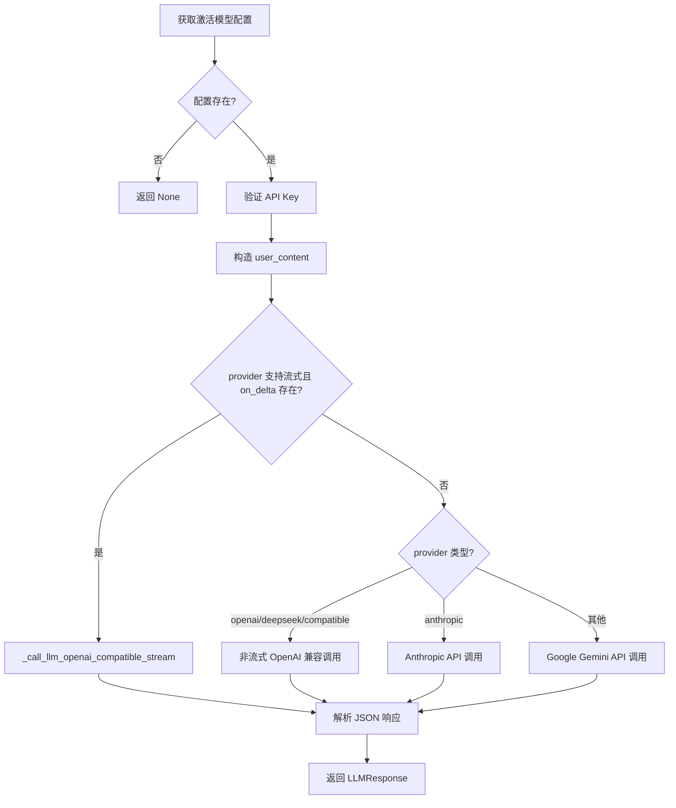

## 🧩 类型定义与数据类

### `LLMDeltaKind` — 增量类型
```python
LLMDeltaKind = Literal["reasoning", "content"]
```
定义流式输出中的两种增量类型：
- `"reasoning"`：推理过程（DeepSeek-R1 等模型的思维链）
- `"content"`：最终回答内容

---

### `LLMDeltaCallback` — 回调函数类型
```python
LLMDeltaCallback = Callable[["LLMStreamDelta"], Awaitable[None] | None]
```
定义回调函数签名：接收 `LLMStreamDelta` 对象，返回 `None` 或异步协程。

---

### `@dataclass(slots=True)` — 流式增量 DTO
```python
@dataclass(slots=True)
class LLMStreamDelta:
    kind: LLMDeltaKind    # 增量类型（reasoning / content）
    text: str             # 增量文本片段
```

---

### `@dataclass(slots=True)` — LLM 响应 DTO
```python
@dataclass(slots=True)
class LLMResponse:
    content: dict[str, Any]          # 解析后的 JSON 内容
    prompt_tokens: int               # 输入 token 数
    completion_tokens: int           # 输出 token 数
    total_tokens: int                # 总 token 数
    model_id: str                    # 数据库中的模型 ID
    model: str                       # 模型名称
    raw_content: str = ""            # 原始文本内容
    reasoning_content: str = ""      # 推理内容（思维链）
    provider: str = ""               # 提供商（openai/deepseek/anthropic/google）
    provider_request_id: str | None = None   # 提供商侧请求 ID
    response_model: str | None = None        # 实际响应的模型名
    duration_ms: int = 0             # 请求耗时（毫秒）
    raw_response: dict[str, Any] | None = None   # 原始 HTTP 响应体
```

---

## 🔧 内部工具函数

### `_json_content(text)` — 提取并解析 JSON
```python
def _json_content(text: str) -> dict[str, Any]:
    cleaned = text.strip()
    # 如果被 Markdown 代码块包裹，剥离 ```json ... ```
    if cleaned.startswith("```"):
        cleaned = cleaned.split("\n", 1)[1].rsplit("```", 1)[0]
    try:
        value = json.loads(cleaned)
    except json.JSONDecodeError as exc:
        raise AppError("llm_invalid_json", "大模型返回了无效 JSON", 502) from exc
    if not isinstance(value, dict):
        raise AppError("llm_invalid_json", "大模型返回结果必须是 JSON 对象", 502)
    return value
```

> **作用**：清洗模型输出的原始文本，提取有效的 JSON 对象。

---

### `_supports_json_object(provider, model)` — 判断是否支持 JSON 模式
```python
def _supports_json_object(provider: str, model: str) -> bool:
    lowered = model.lower()
    # 推理型模型（DeepSeek-R1、Reasoner 系列）不支持 response_format
    if any(token in lowered for token in ("reasoner", "-r1", "r1-", "thinking")):
        return False
    return provider in {"openai", "deepseek", "compatible"}
```

> **作用**：只有 OpenAI/DeepSeek 兼容接口且**非推理模型**，才能使用 `response_format={"type":"json_object"}` 强制 JSON 输出。

---

### `_message_reasoning(message)` — 提取推理内容
```python
def _message_reasoning(message: dict[str, Any]) -> str:
    for key in ("reasoning_content", "reasoning", "thinking"):
        value = message.get(key)
        if isinstance(value, str) and value:
            return value
    return ""
```
尝试从 API 响应消息中提取推理/思维链内容（不同提供商字段名不同）。

---

### `_emit_delta(on_delta, kind, text)` — 发送增量回调
```python
async def _emit_delta(on_delta: LLMDeltaCallback | None, kind: LLMDeltaKind, text: str) -> None:
    if on_delta is None or not text:
        return
    result = on_delta(LLMStreamDelta(kind=kind, text=text))
    if result is not None:
        await result
```
如果回调函数存在，构造增量对象并调用（支持同步或异步回调）。

---

### `_build_user_content(payload)` — 构造用户消息
```python
def _build_user_content(payload: dict[str, Any]) -> str:
    user_content = (
        str(payload.get("_user_prompt"))
        if payload.get("_user_prompt")
        else json.dumps(payload, ensure_ascii=False, separators=(",", ":"))
    )
    if payload.get("retry_feedback"):
        user_content += "\n\n## 上一次输出校验失败，请仅修正以下问题\n" + json.dumps(
            payload["retry_feedback"], ensure_ascii=False, indent=2
        )
    return user_content
```

- 如果 payload 中有 `_user_prompt`，直接使用（自定义提示词）
- 否则将整个 payload 序列化为 JSON 作为用户输入
- 如果有 `retry_feedback`（重试反馈），附加在末尾

---

### `_safe_json(value)` — 安全序列化（用于日志）
```python
def _safe_json(value: Any) -> str:
    try:
        return json.dumps(value, ensure_ascii=False, default=str, separators=(",", ":"))
    except TypeError:
        return repr(value)
```
用于日志记录，遇到无法序列化的对象时回退到 `repr()`。

---

## 🌊 核心：流式调用函数

### `_call_llm_openai_compatible_stream()` — OpenAI 兼容接口流式调用

```python
async def _call_llm_openai_compatible_stream(
    *,
    profile: dict[str, Any],      # 模型配置（provider/model/api_key/base_url）
    system: str,                  # 系统提示词
    user_content: str,            # 用户消息
    payload: dict[str, Any],      # 原始 payload（用于 _preserve_raw）
    on_delta: LLMDeltaCallback | None,  # 增量回调
    request_started: float,       # 请求开始时间（用于计算耗时）
) -> LLMResponse:
```

**工作流程：**

1. **构造请求**
   - 根据 provider 决定 base_url 和 endpoint
   - 构造 OpenAI 兼容的聊天补全请求
   - 如果支持 JSON 模式，添加 `response_format`

2. **流式读取响应**
   - 使用 `httpx.stream()` 逐行读取 SSE（Server-Sent Events）
   - 解析 `data:` 开头的行，提取 JSON chunk
   - 分离 `reasoning_content` 和 `content`

3. **增量回调**
   - 每收到一段推理内容 → 触发 `on_delta("reasoning", text)`
   - 每收到一段正文内容 → 触发 `on_delta("content", text)`

4. **返回结果**
   - 拼接所有片段
   - 解析 JSON（或保留原始文本）
   - 封装为 `LLMResponse` 对象

---

## 🚀 主入口：`call_llm()`

```python
async def call_llm(
    system: str,                  # 系统提示词
    payload: dict[str, Any],      # 用户输入数据
    *,
    on_delta: LLMDeltaCallback | None = None,  # 可选增量回调
) -> LLMResponse | None:
```

**整体流程：**



**三种调用路径：**

| Provider | 流式支持 | 实现方式 |
|----------|---------|---------|
| `openai` / `deepseek` / `compatible` | ✅ 支持 | 流式调用 `_call_llm_openai_compatible_stream` |
| `anthropic` | ❌ 不支持流式 | 非流式调用 Claude API |
| 其他（如 `google`） | ❌ 不支持流式 | 非流式调用 Gemini API |

---

## 💬 聊天模式：`stream_chat()`

```python
async def stream_chat(messages: list[dict[str, str]]) -> AsyncIterator[str]:
    """自由聊天模式，不强制 JSON 输出"""
```

**与 `call_llm()` 的区别：**

| 特性 | `call_llm()` | `stream_chat()` |
|------|-------------|-----------------|
| 输入格式 | `system` + `payload` 字典 | 标准消息列表 `[{"role":..., "content":...}]` |
| 输出格式 | 强制 JSON 对象 | 自由文本 |
| 用途 | 结构化分析任务 | 自由对话 |
| JSON 模式 | 自动启用（如支持） | 禁用 |

**工作流程：**
1. 从消息列表中分离 `system` 消息和普通对话消息
2. 根据 provider 构造不同的 API 请求
3. 流式逐字返回 `content` 片段（或一次性返回完整内容）

---

## 📋 辅助函数

### `_active_chat_profile()`
获取激活模型配置，若不存在或缺少 API Key 则抛出异常。

### `_split_system_messages(messages)`
从消息列表中分离 `system` 角色的消息，其他消息保持原有顺序。

---

## 🧠 设计亮点

| 设计点 | 说明 |
|--------|------|
| **流式优先** | 支持 SSE 流式输出，适合 Web 端实时展示 |
| **多提供商统一** | 抽象出统一的 `LLMResponse`，屏蔽各 API 差异 |
| **推理内容分离** | 将思维链（reasoning）与正文（content）分开处理 |
| **JSON 强制模式** | 自动判断模型是否支持 `response_format=json_object` |
| **重试反馈机制** | 支持 `retry_feedback`，让模型只修正上次的错误 |
| **友好日志** | 记录请求/响应的关键信息，便于排查 |
| **类型安全** | 完整的类型注解，支持 IDE 智能提示 |

---

## 🔍 与您之前提供的 JSON 的关联

您提供的 JSON 文件，就是通过这个模块调用大模型（`deepseek-v4-flash`）后返回的结果：

- `content` 字段包含了解析后的交易决策 JSON（`decision`、`diagnosis_summary`、`bar_analysis` 等）
- `reasoning_content` 字段包含了模型的推理过程（与 `content` 内容几乎相同，因为该模型可能将推理和内容合并输出）
- `usage` 记录了 token 消耗：`prompt_tokens=66441`、`completion_tokens=3625`

---

如果您需要我针对某个具体函数做**更深入的解读**，或者需要**画出更详细的流程图**，请告诉我！


正常实时流式打印的完整代码链路在这里：

1. 从模型流读取 `reasoning_content` 和 `content`

[llm_client.py](/Users/sun/PycharmProjects/PA/backend/app/llm_client.py:182)

```python
reasoning_piece = delta.get("reasoning_content") or delta.get("reasoning")
content_piece = delta.get("content")
```

2. 转换成统一的 `LLMStreamDelta.text`

[llm_client.py](/Users/sun/PycharmProjects/PA/backend/app/llm_client.py:75)

```python
on_delta(LLMStreamDelta(kind=kind, text=text))
```

3. 封装成前端收到的 `llm_delta` 事件

[agent_graph.py](/Users/sun/PycharmProjects/PA/backend/app/agent_graph.py:150)

```python
{
    "type": "llm_delta",
    "stage": stage,
    "kind": delta.kind,
    "text": delta.text
}
```

4. 前端接收并累计文字

实时任务入口：

[App.tsx](/Users/sun/PycharmProjects/PA/frontend/src/App.tsx:1197)

旧流式分析入口：

[App.tsx](/Users/sun/PycharmProjects/PA/frontend/src/App.tsx:1471)

核心逻辑：

```tsx
if (event.type === "llm_delta") {
  const field =
    event.payload.kind === "content"
      ? "content"
      : "reasoning";

  setLlmLive(current => ({
    ...current,
    [stageKey]: {
      ...current[stageKey],
      [field]: current[stageKey][field] + event.payload.text
    }
  }));
}
```

5. 逐字打印组件

[useTypewriterText.ts](/Users/sun/PycharmProjects/PA/frontend/src/useTypewriterText.ts:3)

6. 历史记录不打印的直接原因

[App.tsx](/Users/sun/PycharmProjects/PA/frontend/src/App.tsx:731)

```tsx
const typewriterActive = loading && !historyReplayActive;
```

这里的 `!historyReplayActive` 明确关闭了历史详情的打字机效果。
